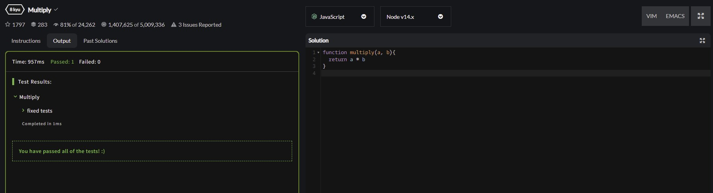

<a href="https://www.core-code.io/">


</a>

# Javascript

# [Index](/README.md)

# Week 2

## Week goal 🏁

<p>Learn about Javascript structure</p>

## Week subtopics

- Data types in Javascript
  - number
    - operators (+,-,/,\*)
  - boolean
    - operators (!, &&, ||)
  - string
    - properties (length, charAt, [])
  - null
  - undefined
- comments in Javascript
  - line comment
  - block comment
- Console
- Loops
  - While
  - For
- Conditionals
  - Ternary operator
- Functions
- Difference between arguments and parameters
- Default parameters
- Arguments array

## Week challenges (Monday) 💻

1. Follow the github course, you can find it [here](https://www.udacity.com/course/version-control-with-git--ud123)
2. Create an account in Codewars, follow [this instructions](./_create_account_codewars/) ✅
3. Read about: [if...else](https://developer.mozilla.org/en-US/docs/Web/JavaScript/Reference/Statements/if...else) ✅
4. Read about: [for](https://developer.mozilla.org/en-US/docs/Web/JavaScript/Reference/Statements/for) ✅
5. Read about: [while](https://developer.mozilla.org/en-US/docs/Web/JavaScript/Reference/Statements/while) ✅
6. Read about: [functions](https://developer.mozilla.org/en-US/docs/Web/JavaScript/Reference/Statements/function) ✅

## Week challenges (Tuesday) 💻

1. [Multiply](https://www.codewars.com/kata/50654ddff44f800200000004/train/javascript)
2. ASCII Total
3. Char From ASCII Value
4. Binary Addition
5. Student's Final Grade

### Solution: ✅

<ol>
  <li>Multiply</li>
</ol>

```javascript
function multiply(a, b) {
  return a * b;
}
```


