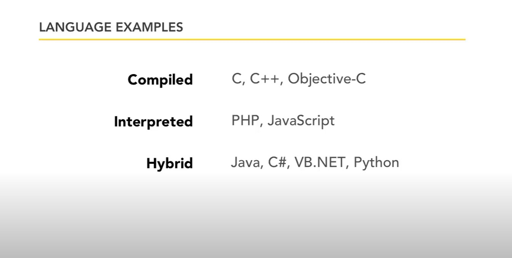

<a href="https://www.core-code.io/">


</a>

# core-code-from-scratch-readme
# [Index](/README.md)
# Week 1 
## Week Challenge Tuesday
### Task

1. Base on [this reading](https://www.freecodecamp.org/news/compiled-versus-interpreted-languages/) and [this video](https://www.youtube.com/watch?v=I1f45REi3k4), create an explanation about `Interpreted And Compiled Programming Languages` in your README

<p>

<strong>Compiled Language:</strong>

Is a programming language which are generally compiled and not interpreted. It is one where the program, once compiled, is expressed in the instructions of the target machine; this machine code is undecipherable by humans. Types of compiled language – C, C++, C#, CLEO, COBOL, etc.

<strong>Interpreted Language:</strong>

An interpreted language is a programming language which are generally interpreted, without compiling a program into machine instructions. It is one where the instructions are not directly executed by the target machine, but instead read and executed by some other program. Interpreted language ranges – JavaScript, Perl, Python, BASIC, etc.

</p>

2. Is Java compiled or interpreted, or both?, check the sources and answer the question in your README

   - [Video Source](https://www.youtube.com/watch?v=G81hoJTvQVg)

   - [Blog Source](https://www.tutorialspoint.com/Why-java-is-both-compiled-and-interpreted-language)

   - [StackOverflow Source](https://stackoverflow.com/questions/1326071/is-java-a-compiled-or-an-interpreted-programming-language)

### Solution:
<ul>
  <li>Is Java compiled or interpreted, or both?</li>
</ul>


<p>
Code written in Java is:

<strong>First compiled</strong> to bytecode by a program called <i>javac</i> as shown in the left section of the image above;

Then, as shown in the right section of the above image, another program called java starts the Java runtime environment and it may <strong>compile and/or interpret</strong> the bytecode by using the Java Interpreter/JIT Compiler.

After reading the article and watched the video given, I agree with the explanation above, which isposted in the stackoverflow source. Java is a hybrid language, it can be interpreted or compiled. 

</p>



### Task

3. <u><strong>Pseudocode Currency Converter</strong></u> exercise

## Helpful Resources 📖

1. [Read about pseudocode](https://cs.wmich.edu/gupta/teaching/cs4310/lectureNotes_cs4310/PseudocodeBasics.pdf)
2. [More about pseudocode](https://www.quora.com/Why-is-pseudocode-useful-to-programmers)
3. [Yet more about pseudocode](https://www.freecodecamp.org/news/what-is-pseudocode-in-programming/)
4. [Check about algorithms](https://www.youtube.com/watch?v=6hfOvs8pY1k)

### Solution:
``` html 
  Starting point: START
  Input: GET <--!User enters amount-->
  Source: BTC (https://www.coindesk.com/price/bitcoin/)
  Total: Input * BTC
  PRINT: Result
  End point: END
```
## Week Challenge Wednesday

### Your date of birth in the matrix?

#### Description

Your team has just seen the movie "Matrix" and you have been asked, how the number of your year of birth would be written in binary. You must learn how to translate your date of birth into binary and show your team. (Do not use a webpage or a tool to convert your date of birth)

#### Help

0. [Take in mind this](https://www.schoolcoders.com/data-representation/binary/powers-of-two)
1. [Learn about binary](https://www.youtube.com/watch?v=LpuPe81bc2w)
2. [Learn how to convert a decimal number to a binary number](https://www.youtube.com/watch?v=rsxT4FfRBaM)

### <u>Solution</u>:

| Hexadecimal | Binary Code |
| --- | --- |
| `11.1.1994` | 1011.1.11111001010 |

## <u>Task</u>

# MIPS

## Description

Based on the [guide](#guide) and the [examples](#examples) of the low-level language, create the following:

### <u><i><strong>Solution</strong></i></u>:

1. Create a program that adds any two given numbers provided by the user

``` assembly
.data
    n1: .asciiz "enter your first number: "
    n2: .asciiz "enter your second number: "
    result: .asciiz "result is "

.text
    #getting first input.
    la $a0, n1
    li $v0, 4
    syscall
    li $v0, 5
    syscall
    move $t0, $v0

    #getting second input.
    la $a0, n2
    li $v0, 4
    syscall
    li $v0, 5
    syscall
    move $t1, $v0

    #calculate and print out the result.
    la $a0, result
    li $v0, 4
    syscall
    add $t3, $t0, $t1
    move $a0, $t3
    li $v0, 1
    syscall

    #end program.
    li $v0, 10
    syscall
```

2. Create a program that displays your name

```assembly
  .data
        message: .asciiz "\nGerson Vasquez\n"
  .text
        main:
              li $v0, 4
              la $a0, message
              syscall
```

## Week Challenge Thursday

## Print special numbers

### Description

In this exercise you must use an iterative flow control to be able to print all the even numbers in the range of numbers from 0 to 100. Remember that you should not print each number, you should use a flow control structure to perform the exercise

### <u>Solution:</u>

``` python
for num in range(0,100):
    if num%2==0:
        print (num)


Output:

2
4
6
8
10
;
98
```
# Bad code

## Description

The code shown below is not working in the right way, as a task you must find the error made by the developer who programmed this code and correct it, for this exercise you must explain what the error is and place the correct code

```javascript
var cond = false;
if ((cond = true)) {
  console.log('The cond variable is true');
} else {
  console.log('The cond variable is false');
}
```

### <u>Solution:</u>

``` javascript
var cond = false;

if (cond == true) 
{
  console.log('The cond variable is true');
} 
else 
{
  console.log('The cond variable is false');
}

Output
"The cond variable is true"
```

# Bad code 2

## Description

You must create the code that follows the following logic, if the given number is 100, take this number as special and show the following message: "This is a special number!", but if the number is less than 1000, multiple of 10 and different from 100, you must show the following message: "This number is almost special". if none of the given conditions are met show the following message: "Just a regular number". Another developer was trying to program the logic, but apparently couldn't, you need to fix the code to work properly

```javascript
var n = 100;
if (n == 100) {
  console.log('This is a special number!');
}
if (n < 1000) {
  console.log('');
} else {
  console.log('Just a regular number');
}
if (n % 10 == 0) {
  console.log('This number is multiple of 10');
}
```
-[Source](https://youtu.be/IsG4Xd6LlsM)

### <u>Solution:</u>

```javascript
var n = 100;
if (n == 100) 
{
  console.log('This is a special number!');
}
else if (n < 1000 && n %10==0) 
{
  console.log('This number is almost special');
} 
else 
{
  console.log('Just a regular number');
}

Output
"This is a special number!"

```